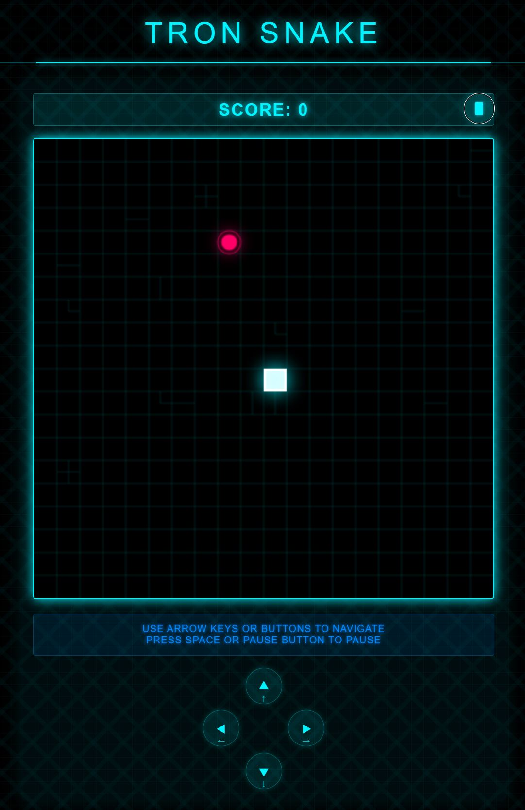

# TRON Snake Game 🐍

A modern, Tron-themed implementation of the classic Snake game using vanilla JavaScript, HTML5 Canvas, and CSS3. Features a stunning neon visual style inspired by the TRON Legacy movie.



## 🎮 Play Now

Experience the game online by visiting our live demo: [Temporary Unavailable]
or opening the index.html with a browser.

## ✨ Features

- 🎯 Responsive design - works on both desktop and mobile devices
- 🌟 Beautiful TRON Legacy-inspired visual effects
- 🎨 Neon glow effects and circuit board patterns
- 🎵 Multiple control options (keyboard, touch, and on-screen buttons)
- 📱 Full touch screen support for mobile devices
- 🏃‍♂️ Progressive difficulty increase
- 🎯 Multiple food items spawning system
- ⏸️ Pause/Resume functionality
- 💫 Smooth animations and transitions

## 🎯 How to Play

1. **Objective**: Control the snake to eat the glowing food items while avoiding walls and the snake's own body
2. **Controls**:
   - **Desktop**:
     - Arrow keys for movement
     - Spacebar to pause/resume
     - On-screen buttons (optional)
   - **Mobile**:
     - Touch controls (swipe gestures)
     - On-screen directional buttons
     - Pause button

3. **Scoring**:
   - Each food item collected: 10 points
   - Game speed increases with each food collected
   - Multiple food items spawn simultaneously

## 🛠️ Technical Implementation

### Technologies Used
- HTML5 Canvas for game rendering
- Vanilla JavaScript for game logic
- CSS3 for styling and animations
- Responsive design principles

### Key Components
1. **Game Engine**:
   - Efficient game loop implementation
   - Collision detection system
   - Speed management
   - State management (pause, game over, etc.)

2. **Rendering**:
   - Canvas-based rendering
   - Particle effects and glowing elements
   - Circuit board background patterns
   - Responsive canvas scaling

3. **Controls**:
   - Multi-input support system
   - Touch gesture handling
   - Keyboard input management
   - On-screen controls

## 🚀 Getting Started

### Prerequisites
- A modern web browser
- Basic understanding of HTML/CSS/JavaScript (for development)

### Installation

1. Clone the repository:
```bash
git clone https://github.com/yourusername/tron-snake-game.git
```

2. Navigate to the project directory:
```bash
cd tron-snake-game
```

3. Open `index.html` in your web browser or set up a local server:
```bash
# Using Python 3
python -m http.server 8000

# Using Node.js
npx http-server
```

4. Visit `http://localhost:8000` in your web browser

## 🎨 Customization

### Visual Customization
- Modify colors in the CSS file
- Adjust game grid size in the JavaScript file
- Customize visual effects and animations

### Game Parameters
You can modify these constants in `game.js`:
```javascript
const INITIAL_SPEED = 100;    // Initial game speed
const MIN_SPEED = 50;         // Maximum game speed
const SPEED_DECREASE = 2;     // Speed increase rate
const gridSize = 20;          // Grid size for game board
```

## 🤝 Contributing

Contributions are welcome! Please feel free to submit a Pull Request. For major changes, please open an issue first to discuss what you would like to change.

1. Fork the repository
2. Create your feature branch (`git checkout -b feature/AmazingFeature`)
3. Commit your changes (`git commit -m 'Add some AmazingFeature'`)
4. Push to the branch (`git push origin feature/AmazingFeature`)
5. Open a Pull Request

## 📝 License

This project is licensed under the MIT License - see the [LICENSE](LICENSE) file for details.

## 🙏 Acknowledgments

- Inspired by the TRON Legacy movie visual style
- Built upon the classic Snake game concept
- Special thanks to the open-source community

## 🔗 URL

Project Link: [https://github.com/wonghunghing/tron-snake-game](https://github.com/wonghunghing/tron-snake-game)

---
Made with ❤️ by unrestrictable